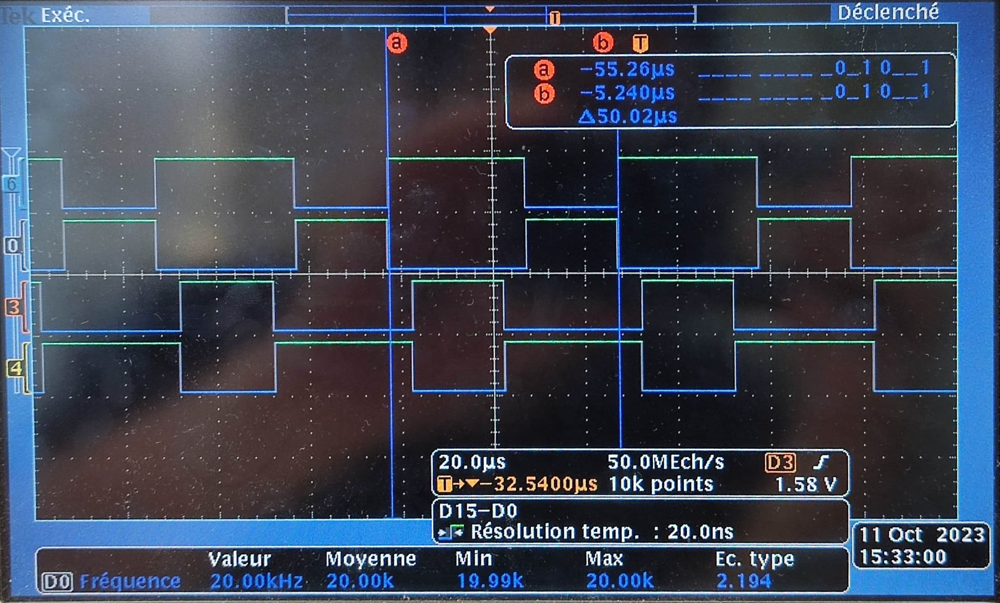
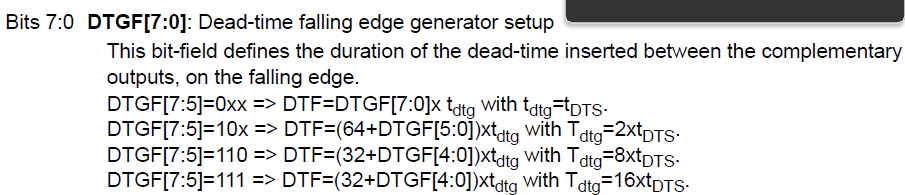
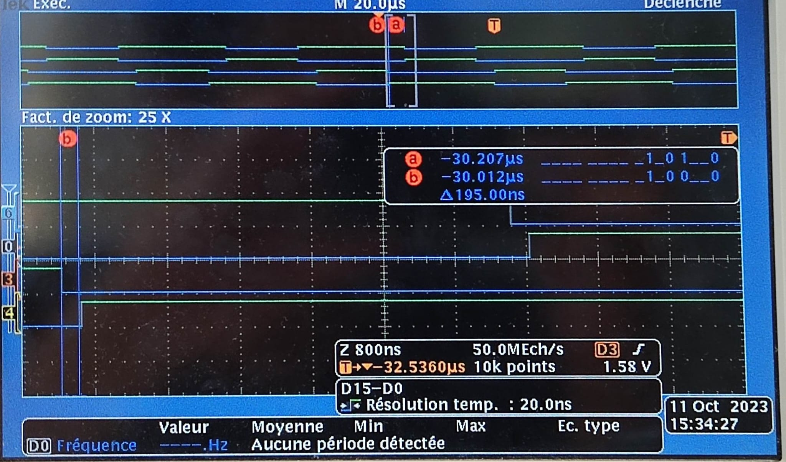

# 2324_ESE3745_DU_THIRUKUMARAN

## OBJECTIF 
L'objectif final du TP est de réaliser l'asservissement en vitesse et en courant d'un moteur. <br> 
Ce TP se compose en 3 parties : <br>
I. La commande de la MCC  <br>
II. La commande en boucle ouverte et mesure du courant et de la vitesse <br>
III. L'asservissement de ces derniers <br>

## I. La commande de la MCC 
Dans cette première partie, nous générons 4 PWM en complémentaire décalée pour contrôler en boucle ouverte le moteur en respectant certaines contraintes. Nous visualisons et vérifions les signaux générés sur l'oscilloscope puis nous réalisons un premier essai de commande de moteur. 

### 1. Génération de 4 signaux PWM 
#### PWM complémentaires
Contraintes : <br>
- Fréquence des PWM : **20kHz** <br> 
- Rapport cyclique : **60%** <br>
- Résolution de **10 bits** <br>
- Temps morts : [Temps morts](#temps-morts)

__Choix du timer 1 en mode :__ <br>
- Channel 1 -> PWM Generation CH1 CH1N <br>
- Channel 2 -> PWM Generation CH2 CH2N <br>

Pour obtenir une fréquence de 20 kHz tout en respectant la résolution et le rapport cyclique, nous configurons les réglages suivants : <br>
- **PSC** : (1-1) = **0** => 170 000 000 Hz <br>
- **ARR** : **8500** => 20 kHz <br>
- **CCR1** ou PWM CH1-CH1N Pulse : = 0.6*ARR = **4950** <br>
- **CCR2** ou PWM CH2-CH2N Pulse : **4950** <br>

#### Visualisation des PWM complémentaires


#### PWM complémentaires en décalage
Pour obtenir les signaux PWM complémentaires en décalage, nous reconfigurons les réglages. <br> 
- **Counteur Mode** : **Center Aligned**, par conséquent <br>
l'**ARR** est divisé par deux : **4250** <br>
- **CCR1** = **2550** <br>
- **CCR2** = ARR-CCR1 = 4250-2550 = **1700** <br>

#### Visualisation des PWM complémentaires en décalage

La fréquence est bien de 1/(50*10^-6) = 20 kHz

### Temps morts
Selon la datasheet du transistor, le Rise Time et le Fall Time sont à 35 ns, soient des temps morts à 70 ns. <br>
Pour être large, nous prenons des temps morts à 200 ns.


```
DTF = 200 ns
tDTS = 1/(170*10^6) = 5.88 ns
DTFG vaut environ 34 est inférieur à 2^7-1 = 127, donc c'est accepté,
nous n'avons pas besoin de tester les formules suivantes
```
Nous rentrons la valeur 34 comme Dead Time dans la zone appropriée.

#### Visualisation des temps morts

Nous retrouvons bien les 200 ns.

### 2. Commande de la vitesse ```speed XX```
Nous contrôlons la vitesse en envoyant une séquence via la liaison UART sous la forme : ```speed XX``` où ```XX``` est un nombre en pourcentage, par exemple ```speed 60``` correspond à un rapport cyclique de ```60%```. <br>
Dans le fichier shell.c, nous rajoutons la commande "speed" :
```c
#define PWM_MAX 100
#define PWM_MIN 0

else if(strcmp(argv[0],"speed")==0){
			float speedVal=atoi(argv[1]);
			if (speedVal> PWM_MAX){
				speedVal=PWM_MAX;
			}
			if (speedVal< PWM_MIN){
				speedVal=PWM_MIN;
			}

			speedVal=(DUTY_MAX*speedVal)/100; //PWM en pourcentage
			__HAL_TIM_SetCompare(&htim1,TIM_CHANNEL_1,speedVal);
			__HAL_TIM_SetCompare(&htim1,TIM_CHANNEL_2,DUTY_MAX - speedVal);

		}

```
Nous fixons le rapport cyclique à 0 ou à 100 :
- 0, si le nombre est négatif
- 100, si le nombre est supérieur à 100

### 3. Premiers tests
Nous avons réalisé des tests pour vérifier le bon fonctionnement de la commande speed. 
Nous varions la vitesse de 10% en 10% pour éviter les forts appels de courant.

## II. La commande en boucle ouverte et mesure du courant et de la vitesse
Dans cette partie, nous réalisons la commande en boucle ouverte du moteur avec une accélération limitée, puis nous mesurons le courant U_Imes et la vitesse à partir des encodeurs du moteur. 

### 1. Commande de la vitesse 
Nous rajoutons d'autres commandes afin de contrôler la vitesse : 
- Commande ```start``` : permet de fixer le rapport cyclique à 50% et activer les PWM
- Commande ```stop``` : permet de désactiver les PWM
  
Ajout des commandes dans le fichier shell.c :

```c
		/*
		 * start -> Activation des PWM avec un rapport cyclique de 50%
		 * stop  -> Désactivation des PWM
		 */
		else if(strcmp(argv[0],"start")==0){

			__HAL_TIM_SetCompare(&htim1,TIM_CHANNEL_1,0.5*DUTY_MAX);
			__HAL_TIM_SetCompare(&htim1,TIM_CHANNEL_2,0.5*DUTY_MAX);
			HAL_TIM_PWM_Start(&htim1, TIM_CHANNEL_1);
			HAL_TIMEx_PWMN_Start(&htim1, TIM_CHANNEL_1);
			HAL_TIM_PWM_Start(&htim1, TIM_CHANNEL_2);
			HAL_TIMEx_PWMN_Start(&htim1, TIM_CHANNEL_2);

		}
		else if(strcmp(argv[0],"stop")==0){
			HAL_TIM_PWM_Stop(&htim1, TIM_CHANNEL_1);
			HAL_TIMEx_PWMN_Stop(&htim1, TIM_CHANNEL_1);
			HAL_TIM_PWM_Stop(&htim1, TIM_CHANNEL_2);

			HAL_TIMEx_PWMN_Stop(&htim1, TIM_CHANNEL_2);
		}
```

### 2. Mesure du courant 
#### Conversion et mesure par pooling 
Nous mesurons le courant de U (U_Imes: pin PA1 -> ADC CHANNEL 1)
Avec la datasheet du capteur du courant, son offset de 1.65V. 
Nous faisons la conversion suivante pour avoir la valeur du courant et puis nous convertissons la valeur de l'ADC pour ainsi obtenir la valeur du courant.

```c
/* Par polling
		 * Commande "adc" qui permet de mesurer le courant
		 * valueADC est la valeur qu'on récupère de l'ADC
		 * valueCurrent -> Variable qui correspond à la valeur du courant
		 */

		uint16_t valueADC;
		float vs_adc;
		float valueCurrent;

		else if(strcmp(argv[0],"adc")==0){

			HAL_ADC_Start(&hadc1);
			valueADC= HAL_ADC_GetValue(&hadc1);
			vs_adc = (valueADC/4096.0)*VOLTAGE;
			valueCurrent = (vs_adc-OFFSET)/NOMINAL_SENSITIVE;

			sprintf(adc, "Courant : %f A\r\n", valueCurrent);
			HAL_UART_Transmit(&huart2,(uint8_t*)adc,strlen(adc),HAL_MAX_DELAY);
		}
```
#### Conversion et mesure par DMA 

Nous réalisons  la  mesure du courant en utilisant le DMA. Pour cela, il y a plusieurs configuration à faire : <br>
1. Configurer le timer  <br>
2. Configuer l'ADC  et du DMA<br>
3. Coder la conversion dans le callback de l'ADC <br>
4. Configurer une commande "adc_dma" sur le shell <br>

Nous choisissons le mode "Update Envent" dans la partie Trigger Output du timer 1. Ce mode permet au timer de générer des déclenchements à intervalles réguliers. Nous utilisons ces déclenchements pour lancer la conversion. 
#
Pour l'ADC, dans la partie "ADC_Regular_ConversionMode", nous avons choisi le mode Timer 1 Trigger Out event pour "External Trigger Conversion Source". 
Ce mode permet de lancer la conversion à chaque déclenchement du timer 1.  
#
Nous activons aussi l'interruption de l'ADC pour faire la conversion de la valeur en sortie de l'ADC. <br>
Pour le DMA, nous fixons une requête DMA du chanel 2 de l'ADC vers la mémoire puis nous réalisons la conversion dans le Callback  : "HAL_ADC_ConvCpltCallback"

```c

	#define VOLTAGE 3.3
	#define OFFSET 1.65
	#define NOMINAL_SENSITIVE 0.05

	float vout_ADC;
	uint16_t val_DMA = ADC_Buffer[0];
	vout_ADC = (val_DMA/ 4096.0) * VOLTAGE;
	Imesf =(vout_ADC - OFFSET) / NOMINAL_SENSITIVE;
	/*
	 * Conversion PAR DMA
	 * 4096 -> 12 bits de résolution pour l'ADC
	 * Imesf -> La varibale qui contient le courant pour la methode ADC/TIM/DMA
	 */
```

Commande ```adc_dma``` du shell.c

```c
else if(strcmp(argv[0],"adc_dma")==0){
	sprintf(adc_dma, "Courant : %f A\r\n",Imesf);
	HAL_UART_Transmit(&huart2,(uint8_t*)adc_dma,strlen(adc_dma),HAL_MAX_DELAY);
		}
```


### 3. Mesure de la vitesse 
> Commande ```encoder``` réalisée durant les vacances, marchera t-elle ?  
#
Pour la vitesse, nous nous plaçons en mode encodeur <br><br>
__Choix du timer 4 en mode :__ <br>
- Combined Channel -> Encoder Mode <br>

Pour calculer la vitesse, nous faisons le choix d'activer l'interruption du timer 5 toutes les 10 ms.
Nous récupérons la vaeur du compteur de l'encodeur (timer 4), celui-ci est multiplié par 100 Hz (d'où les 10 ms) puis divisé par la résolution de l'encodeur : 4096 (12 bits).

```c
void TIM5_IRQHandler(void)
{
  /* USER CODE BEGIN TIM5_IRQn 0 */
	encoder_speed = TIM4->CNT*ENCODER_FREQUENCY/ENCODER_RESOLUTION;
	TIM4->CNT = 0;
  /* USER CODE END TIM5_IRQn 0 */
  HAL_TIM_IRQHandler(&htim5);
  /* USER CODE BEGIN TIM5_IRQn 1 */

  /* USER CODE END TIM5_IRQn 1 */
}
```
## III. L'asservissement
Nous n'avons pas réalisé l'asservissement
## Remarques
Nous n'avons pas réalisé de Doxygen, nous n'avons pas spécialement écrit des fonctions, l'essentiel est dans la Shell_Loop. <br> Il y a un callback et un appel d'interruption.
## Auteurs
Clément DU <br>
Laksan THIRUKUMARAN
